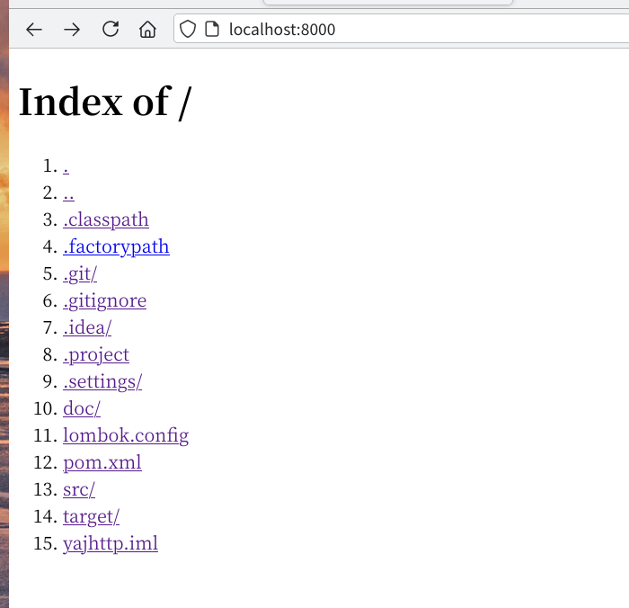
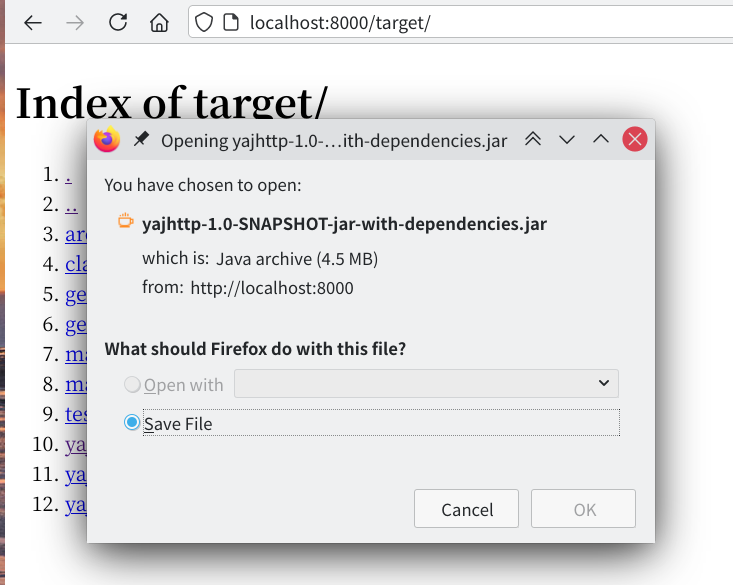

# 计网第 26 组大作业报告 —— yajhttp

## 人员分工

|   姓名   |   学号    |                分工                 |
| :------: | :-------: | :---------------------------------: |
|  陈枕戈  | 191250013 | HTTP 消息解析、（服务器）注册与登录 |
|  侯为栋  | 191250045 |         （服务器）条件请求          |
|  陈子鸿  | 191250014 |         （服务器）文件传输          |
| 李蒋泽辰 | 191250071 |      （客户端）发送与接收消息       |
|  潘昱光  | 191250109 |        （客户端）命令行解析         |

## 项目概要

yajhttp (Yet Another Java HTTP implementation) 包含一个解析 HTTP 消息的类库以及在这之上实现的一对服务器与客户端程序。

服务器端受 Python http.server 模块启发，主要用途为通过 HTTP 传输本地文件，并包含登录、注册、条件请求、长链接等功能。

客户端受 curl 启发，可向指定地址发送 HTTP 请求并将响应内容输出至终端或文件中。支持 GET、POST 方法与 HTTP Basic Authentication。

- 项目地址：https://github.com/amnore/yajhttp

## 使用方法

浏览器中打开截图：



下载 jar 包截图：



```sh
# 编译项目
# 可执行文件打包为 target/yajhttp-1.0-SNAPSHOT-jar-with-dependencies.jar
mvn package

# 执行 Server，由于 Client 与 Server 在同一个文件中，需选择一个执行
java -cp target/yajhttp-1.0-SNAPSHOT-jar-with-dependencies.jar nju.yajhttp.Server

# 此时可使用浏览器打开 http://localhost:8000/_/signup 进行注册
# 输入用户名与密码 123456:123456

# 注册成功之后，在客户端使用用户名和密码获取文件，假设此时在项目根目录下
java -cp target/yajhttp-1.0-SNAPSHOT-jar-with-dependencies.jar nju.yajhttp.Client -u 123456:123456 http://localhost:8000/pom.xml

# 也可以使用 -o <file> 输出到文件
java -cp target/yajhttp-1.0-SNAPSHOT-jar-with-dependencies.jar nju.yajhttp.Client -u 123456:123456 -o /tmp/pom.xml http://localhost:8000/pom.xml

# 还可以在浏览器中直接打开 http://localhost:8000/（需输入用户名和密码），服务器会列出当前目录下的文件
# 服务器支持多种 MIME Type，包括 text/html, text/plain, text/xml, application/x-java-archive（jar 包）等，可在浏览器中正常查看或下载对应文件

# 服务器支持 If-None-Match 条件请求
# 查看文件的 ETag
curl -iu 123456:123456 http://localhost:8000/pom.xml | grep ETag
# 假设返回 ETag 为 288637e1fa316a90cedc9dcc11381e88
# 发送条件请求，服务器应返回 304 Not Modified
curl -iu 123456:123456 -H 'If-None-Match: 288637e1fa316a90cedc9dcc11381e88' http://localhost:8000/pom.xml
```

## 完整选项

客户端：

```
$ java -cp target/yajhttp-1.0-SNAPSHOT-jar-with-dependencies.jar nju.yajhttp.Client -h
-u --user <username:password>: 指定用户名和密码
-o <file>: 输出到文件
-d --data <data>: 指定使用 POST 请求以及 body
-H --header <header>: 指定发送请求时的 header，可以多次使用以指定多个 header
-h --help: 打印帮助信息
<url>: 要请求的网址
```

服务器：

```
$ java -cp target/yajhttp-1.0-SNAPSHOT-jar-with-dependencies.jar nju.yajhttp.Server -h
usage: yajhttp-server [option]... [port]
options:
    --directory <dir>   Base directory of server
 -h,--help              Print help message
```

## 项目结构

```
.
├── doc # 文档
└── src/main/java/nju/yajhttp
    ├── Client.java # 客户端主类
    ├── Server.java # 服务器主类
    ├── interceptor # 条件请求处理
    ├── message # HTTP 消息解析
    └── util # 工具类
```

## 实现方式

Client：

1. 解析命令行参数，利用 Request 类中的方法构造请求
2. 利用 `Request.write` 发送请求，使用 `Response.read` 解析响应
3. 输出回复内容

Server：

1. 解析参数，监听端口
2. 维护一个线程池，在请求到达后选取其中一个线程响应请求
3. 线程使用 `Request.read` 解析请求
4. 在需要时验证用户名与密码
5. 根据请求类型发送或写入文件
6. 发送回复

## 关键类说明

| 名称                                                              | 方法                 | 作用                                                         |
| ----------------------------------------------------------------- | -------------------- | ------------------------------------------------------------ |
| yajhttp.message.{Request,Response}                                |                      | 代表一个 HTTP 请求或响应消息，可以从流中解析或发送           |
|                                                                   | read                 | 从输入流中读取消息                                           |
|                                                                   | write                | 将消息写到输出流中                                           |
| yajhttp.message.{Method,Util,URI,Version,Status,Constants,Header} |                      | 代表 HTTP 消息中相应字段                                     |
| yajhttp.Server                                                    |                      | 服务器主类，保存了服务器的选项等信息                         |
|                                                                   | main                 | 服务器主函数，负责解析参数、监听端口                         |
| yajhttp.RequestHandler                                            |                      | Runnable 对象，负责处理请求                                  |
|                                                                   | run                  | 服务器处理请求函数，调用 RequestHandler 类中其他方法完成处理 |
|                                                                   | handleGet            | 处理 GET 请求                                                |
|                                                                   | handlePost           | 处理 POST 请求                                               |
| yajhttp.interceptor.ConditionProcessor                            |                      | 处理条件请求的类                                             |
| yajhttp.Client                                                    |                      | 客户端主类，存储选项等信息                                   |
|                                                                   | main                 | 客户端主函数                                                 |
|                                                                   | parse                | 解析选项                                                     |
|                                                                   | sendRequest          | 发送请求                                                     |
|                                                                   | handleResponseStatus | 处理响应                                                     |
|                                                                   | output               | 输出到终端或文件                                             |
